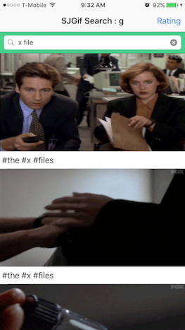

# SJGIF Searcher
SJGIFSearcher is a [Giphy API](https://api.giphy.com) client for iOS in Swift. 

##Features

- Giphy's API endpoints: trending, search 
- Filtering to only show family friendly gifs (rated y,g, or pg).  
- [MVVM pattern](https://en.wikipedia.org/wiki/Model%E2%80%93view%E2%80%93viewmodel) 
- Auto layout 

##Usage
To run this project, clone the repo, and run "pod install" first. 
You need to read about [Giphy's Access and API keys](https://github.com/Giphy/GiphyAPI#access-and-api-keys) 
 

##Dependencies
- [AlamoFire](https://github.com/Alamofire/Alamofire) 
- [Gifu](https://github.com/kaishin/Gifu) 

##Author
Sungjin Lee yoursungjin@gmail.com sungjinlee0417@gmail.com
